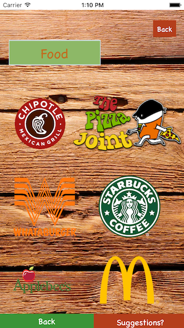
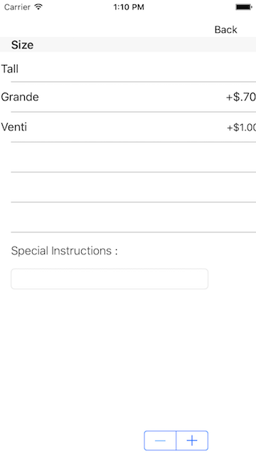

HyperSonik
======
HyperSonik is an iOS app that allows users to order food and get it deliver to their workspace or home. 

Screenshots
======
 

Video
======
https://www.youtube.com/watch?v=8CZ30nZhz9k&feature=youtu.be

Useful links 
======
What is Watson? http://www.ibm.com/watson/

Contribute 
======
Go to the specific folder you want to contribute in i.e Website or Main. Then you can fork this folder and import through Android Studio.

Cook - Website Folder
======
View the README.md on the Website folder. In this folder we have implemented a website for the cook/chef to view when the customer places an order.

Restaurant Customer - Main Folder
======
In this folder we have implemented an Android Java Application for restuarant customers to place their orders manually or through speech. 

